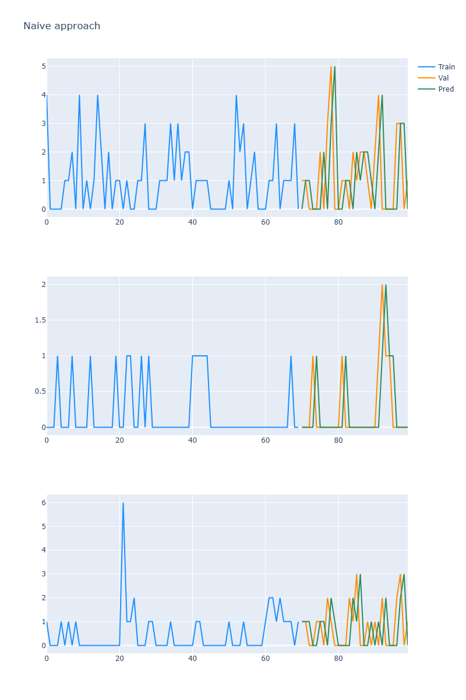

# 📊 Demand Forecasting using Time Series (Walmart Sales)

A machine learning project focused on **forecasting future sales using time series analysis** based on the famous **Walmart M5 Forecasting dataset**.  
The project explores data visualization, preprocessing, and multiple forecasting algorithms to predict demand patterns.

---

# 🚀 Project Overview

Demand forecasting plays a crucial role in **retail supply chain management**.  
Accurate sales prediction helps companies optimize:

- Inventory management
- Supply chain planning
- Pricing strategies
- Business decision making

This project analyzes **hierarchical sales data from Walmart stores** across the states of:

- **California**
.png>)

- **Texas**
.png>)

- **Wisconsin**
.png>)

Using various **time series forecasting techniques**, the model predicts future product demand.

---

# 📂 Dataset Information

The dataset is based on the **M5 Forecasting Accuracy Competition**.

It contains:

- Historical daily sales data
- Store information
- Product categories
- Calendar data
- Price data

The hierarchical structure includes:
State → Store → Category → Department → Item

---

# 📊 Exploratory Data Analysis (EDA)

EDA was performed to understand the structure and behavior of sales patterns.

Key analysis includes:

- Sales trend visualization
- Seasonal pattern detection
- Store-wise sales comparison
- State-level demand analysis
- Data denoising techniques

Visualization tools used:

- **Matplotlib**
- **Plotly**

.png>)

---

# 🧠 Forecasting Models Used

Multiple forecasting models were implemented and compared.

### 1️⃣ Naive Forecasting
Simple baseline model that assumes future values equal previous observations.

### 2️⃣ Moving Average
Smooths fluctuations to identify underlying trends.
.png>)

### 3️⃣ Holt Linear Trend
Captures both **level and trend components** of time series.
.png>)

### 4️⃣ Exponential Smoothing
Applies exponentially decreasing weights to past observations.
.png>)

### 5️⃣ ARIMA
A powerful statistical model for time series forecasting using:

- Auto Regression
- Differencing
- Moving Average
.png>)

### 6️⃣ Prophet
A forecasting tool developed by Facebook designed for:

- Seasonality detection
- Trend modeling
- Holiday effects
.png>)

---

# 🔧 Model Training Strategy

The dataset was split into:

-- Training Data

-- Validation Data

Models were trained on historical data and evaluated using forecasting error metrics.

---

# 📉 Model Evaluation

Each model was compared using forecasting loss metrics such as:

- Mean Absolute Error (MAE)
- Root Mean Squared Error (RMSE)

This allows identification of the **best performing forecasting model**.

---

# 📌 Project Workflow

Data Collection
↓
Data Cleaning
↓
Exploratory Data Analysis
↓
Time Series Modeling
↓
Forecast Generation
↓
Model Evaluation

---

# 🛠️ Technologies Used

- Python
- Pandas
- NumPy
- Matplotlib
- Plotly
- Statsmodels
- Facebook Prophet
- Scikit-Learn
- Jupyter Notebook
- Arima

---

# 📁 Project Structure

Demand-Forecasting-Time-Series
│
├── data
│ └── walmart_sales_dataset
│
├── notebooks
│ └── demand_forecasting.ipynb
│
├── models
│
├── visualizations
│
└── README.md

---

# 📈 Key Insights

- Sales show **clear seasonal patterns**
- Demand varies significantly across **states and stores**
- Advanced models like **Prophet and ARIMA outperform basic methods**

---

# 🎯 Applications

Demand forecasting models like this can be used in:

- Retail inventory management
- Supply chain optimization
- Sales prediction
- Business planning
- Smart stock replenishment systems.

---

